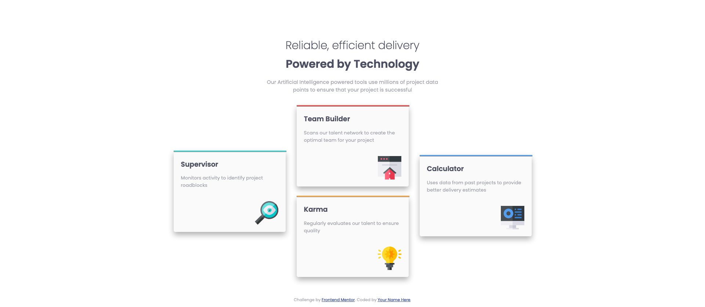

# Frontend Mentor - Four card feature section solution

This is a solution to the [Four card feature section challenge on Frontend Mentor](https://www.frontendmentor.io/challenges/four-card-feature-section-weK1eFYK). Frontend Mentor challenges help you improve your coding skills by building realistic projects. 

## Table of contents

- [Overview](#overview)
  - [The challenge](#the-challenge)
  - [Screenshot](#screenshot)
  - [Links](#links)
- [My process](#my-process)
  - [Built with](#built-with)
  - [What I learned](#what-i-learned)
  - [Continued development](#continued-development)
  - [Useful resources](#useful-resources)
- [Author](#author)

## Overview

### The challenge

Users should be able to:

- View the optimal layout for the site depending on their device's screen size

### Screenshot




### Links

- Solution URL: [GitHub](https://github.com/martinw0/four-card)
- Live Site URL: [GitHub pages](https://martinw0.github.io/four-card/)

## My process

### Built with

- Semantic HTML5 markup
- CSS custom properties
- Flexbox
- Sass

### What I learned

How to [customize the hr](https://www.w3schools.com/howto/howto_css_style_hr.asp)
```
hr {
        border-top: 3px solid $red;
}
```

Select an element by class
```
// Select the second .card element
.card:nth-of-type(2) {
  background-color: red;
}
```

Select all child but not the first
```
:not(:first-child) {
  background-color: red;
}
```


### Continued development

- Sass
  - Partials
  - Mixins
  - Extends
- Improve the use of css selectors like nth-child


### Useful resources

- [Learn sass](https://sass-lang.com/guide)
- [box-shadow generator](https://developer.mozilla.org/fr/docs/Web/CSS/CSS_Backgrounds_and_Borders/Box-shadow_generator)
- [nth child grafikart](https://www.youtube.com/watch?v=DymZtovzd4o)

## Author

- Frontend Mentor - [@martinw0](https://www.frontendmentor.io/profile/martinw0)
- Twitter - [@leWalletM](https://www.twitter.com/leWalletM)